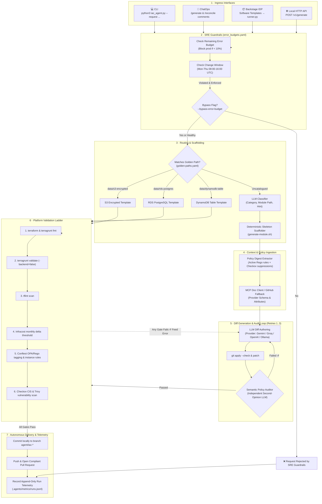
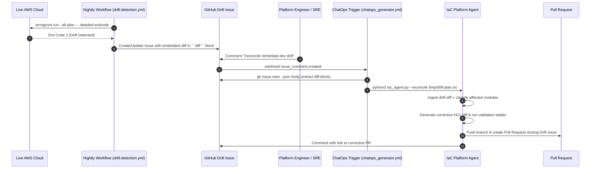

# Autonomous IaC Platform Agent & SRE Automation

The **IaC Platform Agent** is an autonomous platform engineering and SRE capability built directly into this repository. It transforms natural-language infrastructure requests, Backstage IDP actions, GitHub ChatOps comments, and nightly drift detection alerts into compliant, pre-vetted Terragrunt modules through a closed-loop validation and governance ladder.

---

## Architecture & Visual Flow



---

## Closed-Loop Drift Reconciliation Flow



---

## Setup & Prerequisites

### 1. Python Environment
The agent requires Python 3.10+ and packages listed in `.agents/requirements.txt`:

```bash
# Install dependencies
pip install -r .agents/requirements.txt
```

### 2. Model Provider Configuration
Choose between cloud providers or a 100% offline local model:

```bash
# Option A: Google Gemini (default)
export GEMINI_API_KEY="your-gemini-key"

# Option B: Groq (high-speed Llama 3.3)
export GROQ_API_KEY="your-groq-key"

# Option C: OpenAI
export OPENAI_API_KEY="your-openai-key"

# Option D: Fully offline local Ollama (zero API key, zero cost)
ollama pull llama3.1
export OLLAMA_BASE_URL="http://localhost:11434/v1"
export OLLAMA_MODEL="llama3.1"
```

### 3. Local IaC Tooling
The validation ladder reuses standard repository tooling:
- `terraform` (`>=1.15`)
- `terragrunt` (`>=1.0.3`)
- `tflint`
- `conftest` (OPA policies in `policies/terraform/`)
- `checkov` & `trivy` (optional for local offline runs; runs automatically in CI)
- `infracost` (optional; used when `--cost-threshold` is set)

---

## How to Use the Agent

### Method 1: Interactive CLI

The CLI is the primary local tool for developers and architects.

#### 1. Dry-Run Verification (Zero Git Side-Effects)
Safely inspect what the agent would match or scaffold without altering git branches or creating files:
```bash
python3 .agents/scripts/iac_agent.py --request "add an S3 bucket for build artifacts" --dry-run
```

#### 2. Golden-Path Scaffolding (Deterministic, Zero LLM HCL)
Pre-vetted modules (`data/s3-encrypted`, `data/rds-postgres`, `data/dynamodb-table`) are rendered deterministically:
```bash
# Generate compliant S3 bucket
python3 .agents/scripts/iac_agent.py --request "add an S3 bucket for build artifacts" --env dev

# Generate RDS PostgreSQL instance
python3 .agents/scripts/iac_agent.py --request "provision an RDS postgres database for orders" --env dev

# Generate DynamoDB table with PITR and encryption
python3 .agents/scripts/iac_agent.py --request "provision a DynamoDB table for user sessions" --env dev
```

#### 3. Multi-Module Graph Decomposition (`--graph`)
Topologically decomposes composite infrastructure requests into ordered steps and injects cross-module dependencies:
```bash
python3 .agents/scripts/iac_agent.py --request "stand up microservice environment: VPC + EKS + RDS" --graph --dry-run
```

#### 4. Cost-Gated Generation (`--cost-threshold`)
Blocks generation if projected monthly cost delta exceeds your threshold in USD:
```bash
python3 .agents/scripts/iac_agent.py --request "add large compute cluster" --cost-threshold 50.0
```

#### 5. Local Offline Ollama Provider
Run the entire loop completely on your machine without external internet or API keys:
```bash
python3 .agents/scripts/iac_agent.py --request "add storage bucket" --provider ollama --skip-plan
```

---

### Method 2: GitHub ChatOps Trigger

Trigger the agent directly from GitHub Issues or Pull Requests:

1. **Self-Service Generation**:
   Comment on any issue:
   ```text
   /generate add an S3 bucket for release artifacts --env dev
   ```
2. **Automated Drift Remediation**:
   Comment on a nightly drift detection issue:
   ```text
   /reconcile remediate dev drift
   ```

The workflow `.github/workflows/chatops_generator.yml` runs inside the hardened toolchain container, scaffolds the module, validates it through the ladder, pushes `agent/iac-*`, and opens a pull request linked back to the issue.

---

### Method 3: Backstage / IDP Integration

Execute infrastructure generation as part of an Internal Developer Portal (Backstage Scaffolder action):

```bash
python3 .agents/backstage/runner.py --input-json '{
  "request": "create an encrypted s3 bucket for telemetry",
  "env": "dev",
  "region": "eu-central-1",
  "skip_plan": true
}'
```

Returns structured JSON containing `success`, `branch_name`, `branch_url`, `catalog_id`, and `files_changed`.

---

### Method 4: Local HTTP Platform API (`--serve`)

Run the agent as a local REST API daemon for integrations and IDE plugins:

```bash
python3 .agents/scripts/iac_agent.py --serve --port 8000
```

> [!NOTE]
> The server binds to `127.0.0.1` by default for security.

#### Endpoints:
- `GET /v1/health`: Returns service health status.
- `GET /v1/catalog`: Lists active golden-path templates.
- `GET /v1/metrics`: Returns aggregated execution metrics.
- `POST /v1/generate`: Generates infrastructure from a JSON request:
  ```bash
  curl -X POST http://127.0.0.1:8000/v1/generate \
    -H "Content-Type: application/json" \
    -d '{"request": "add an S3 bucket for logs", "env": "dev", "dry_run": true}'
  ```

---

## Governance & SRE Policies

### Error-Budget Policy (`.agents/sre/error_budgets.yaml`)
- **Prod Threshold**: If production error budget drops below 10%, automated changes to `prod` are blocked unless `--bypass-error-budget` is passed with SRE approval.
- **Change Windows**: Restricts production changes to allowed windows (default: `Mon-Thu 08:00-16:00 UTC`). Can be strictly enforced via `enforce_change_windows: true` or `ENFORCE_CHANGE_WINDOWS=1`.

---

## Testing & Quality Control

```bash
# Run unit test suite (11 tests: catalog, change windows, dry-run safety, heuristics)
python3 -m unittest discover -s .agents/tests

# Run classification eval harness (4 offline fixtures)
python3 .agents/scripts/iac_agent_eval.py

# Display telemetry and run health summary
python3 .agents/scripts/iac_agent.py --metrics-summary
```
